# Flow Diagrams - Book My Venue

Complete visual flow diagrams for all major workflows in the Book My Venue platform.

---

## 1. Customer Journey Flow

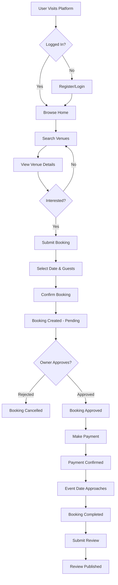

---

## 2. Venue Owner Workflow

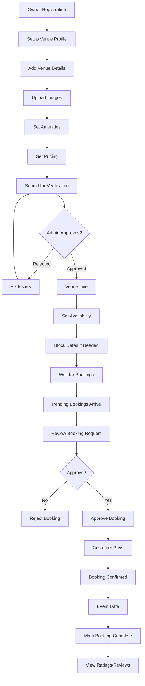

---

## 3. Admin Dashboard Workflow

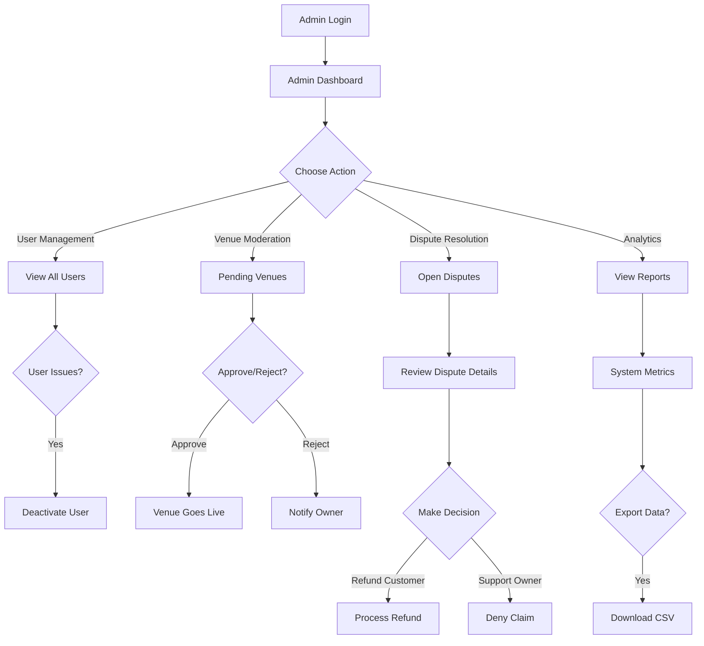

---

## 4. Booking Process Flow

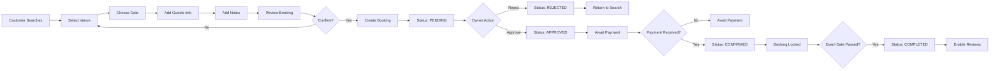

---

## 5. API Request Flow

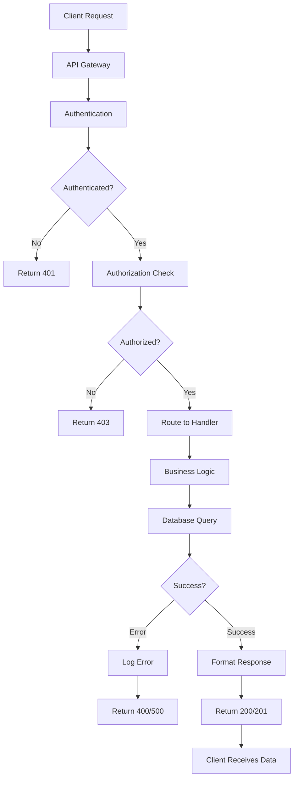

---

## 6. Authentication Flow

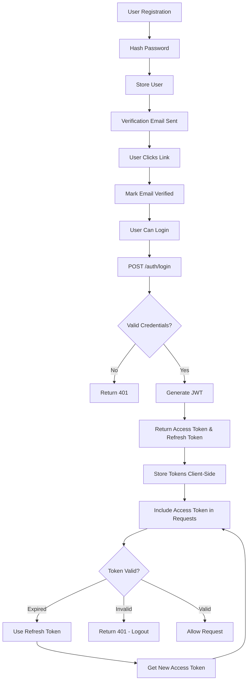

---

## 7. Venue Search Flow

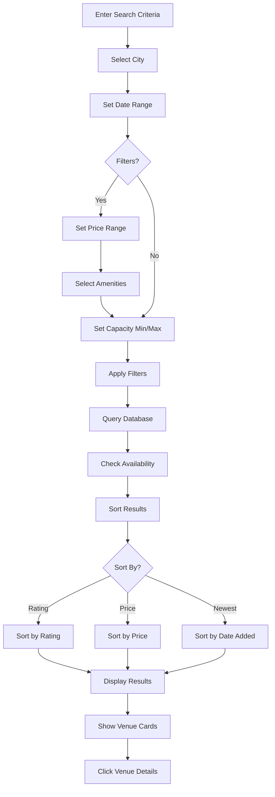

---

## 8. Payment & Confirmation Flow

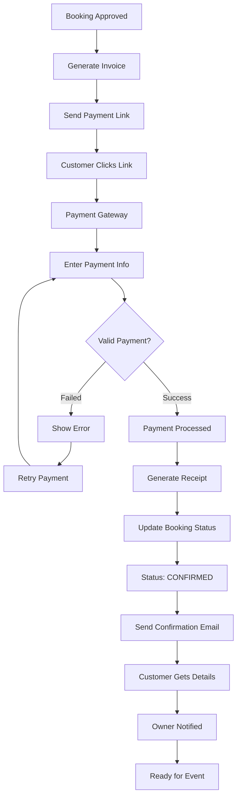

---

## 9. Review & Rating Flow

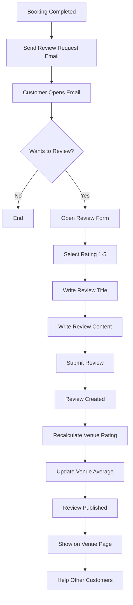

---

## 10. System Architecture Flow

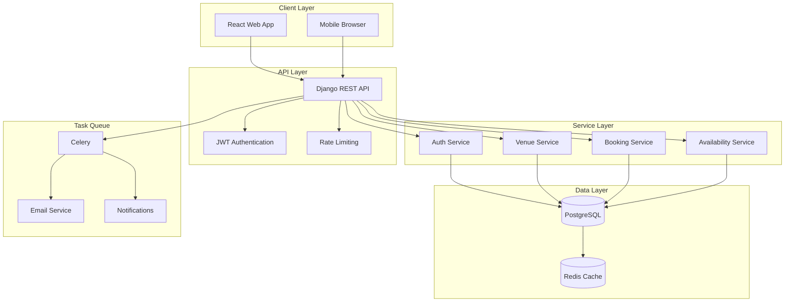

---

## 11. Error Handling Flow

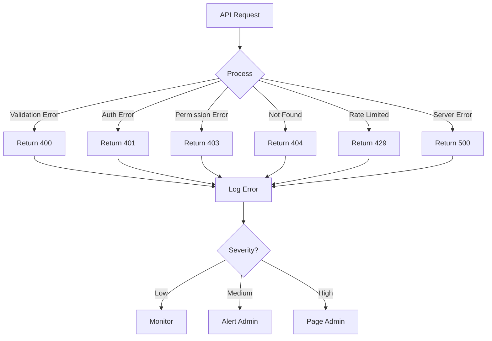

---

## 12. Availability Management Flow

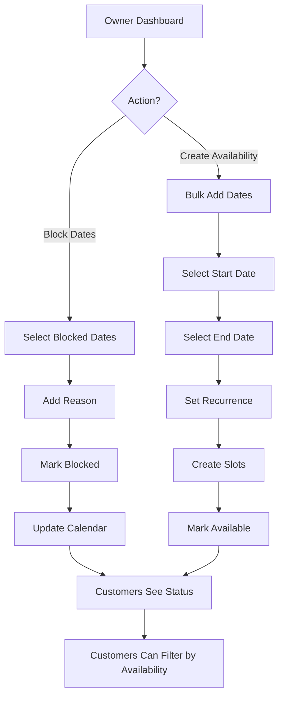

---

## Quick Reference: Status Flows

### Booking Status Flow
```
PENDING → (Owner rejects) → REJECTED
PENDING → (Owner approves) → APPROVED → (Payment) → CONFIRMED → COMPLETED
CONFIRMED → (Customer cancels) → CANCELLED
```

### Venue Status Flow
```
SUBMITTED → (Admin reviews) → APPROVED / REJECTED
APPROVED → (Owner can edit) → PENDING_VERIFICATION
PENDING_VERIFICATION → APPROVED / REJECTED
```

### User Status Flow
```
ACTIVE → (Admin action) → DEACTIVATED
DEACTIVATED → (Can't use platform)
```

---

## Integration Points

### Frontend to API
- All requests include JWT token in header
- Request/response in JSON format
- Error responses include error code and message

### API to Database
- All queries use ORM (Django ORM)
- Connection pooling via Redis
- Indexes on frequently queried fields

### API to External Services
- Email service for notifications
- Payment gateway for transactions
- AWS S3 for image storage

---

## Data Flow Example: Complete Booking

```
1. Customer searches (Client) → API /venues/search
2. API queries Database → Filters venues
3. Customer views details → API /venues/{id}
4. Customer creates booking → API /bookings/
5. API validates availability → Checks database
6. Creates booking record → Saves to DB
7. Sends notification → Celery queue
8. Owner receives email → Email service
9. Owner approves booking → API /bookings/{id}/approve
10. API updates status → Database updated
11. Sends confirmation → Email to customer
12. Customer makes payment → Payment gateway
13. Payment webhook → API /webhooks/payment
14. API confirms booking → Database updated
15. Sends confirmation emails → Both parties
```

---

**Last Updated:** May 25, 2026  
**Version:** 1.0  
**Status:** Complete
